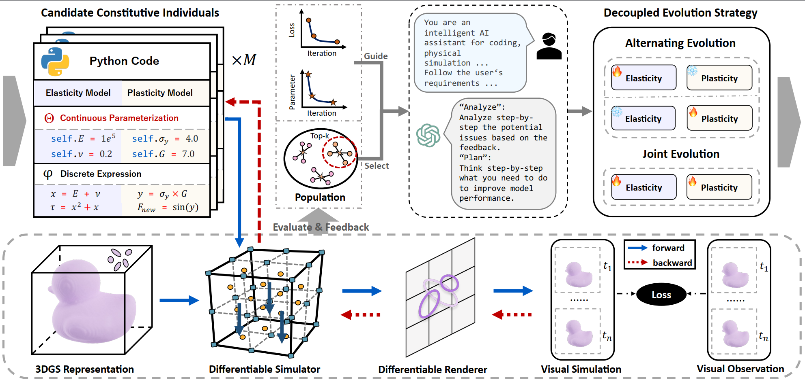

<div align="center">

# VisionLaw: Inferring Interpretable Intrinsic Dynamics from Visual Observations via Bilevel Optimization

Jiajing Lin , Shu Jiang , Qingyuan Zeng , ZhenZhong Wang , Min Jiang*

### [Project Page](xxx)    |    [Paper](https://arxiv.org/abs/2508.13792)

</div>

## Overview


VisionLaw is a framework for inferring interpretable intrinsic physical dynamics directly from visual observations via bilevel optimization. At the upper level, we introduce an LLMs-driven decoupled constitutive evolution strategy, where LLMs are prompted to act as physics experts to generate and revise constitutive laws, with a built-in decoupling mechanism that substantially reduces the search complexity of LLMs. At the lower level, we introduce a vision-guided constitutive evaluation mechanism, which utilizes visual simulation to evaluate the consistency between the generated constitutive law and the underlying intrinsic dynamics, thereby guiding the upper-level evolution. 

## Getting Started

### Installation

Clone the repository:

```bash
git clone https://github.com/JiajingLin/VisionLaw.git
cd VisionLaw
# Create conda environment
conda create -n visionlaw python=3.10
conda activate visionlaw
pip install torch==2.1.2 torchvision==0.16.2 torchaudio==2.1.2 --index-url https://download.pytorch.org/whl/cu118

# Install gaussian-splatting
git clone https://github.com/graphdeco-inria/gaussian-splatting --recursive
cd gaussian-splatting
# Checkout the compatible version
git checkout b17ded92b56ba02b6b7eaba2e66a2b0510f27764 --recurse-submodules
pip install submodules/diff-gaussian-rasterization
pip install submodules/simple-knn
cd ..

# Install requirements
pip install -r requirements.txt
```

### Dataset Preparation

We consider both [synthetic data](https://1drv.ms/u/c/3f1ccc11f481c100/EZUKCz9lrVBLquZGaXqvF1IB_XVKBBx4BK2LAt8GuFpVZQ?e=ub9Jek) and [real-world data](https://1drv.ms/u/c/3f1ccc11f481c100/Edqcvj_qOK9HgWycdfX53UMBn-5XTTh3VDcu56CcNEzx6A?e=LT0R1j) in our experiments.   
These datasets are collected from NeuMA. Please refer to the NeuMA project for more details.

1. Download the assets from the [here](https://onedrive.live.com/?redeem=aHR0cHM6Ly8xZHJ2Lm1zL2YvYy8zZjFjY2MxMWY0ODFjMTAwL0VnUURMMjcwT2p4RG1iWFFoTUItSWJjQndLODllMnhRa3BaQ3JXbWx4c1FDNkE%5FZT1HaEpsSDk&id=3F1CCC11F481C100%21s6e2f03043af4433c99b5d084c07e21b7&cid=3F1CCC11F481C100), and place the downloaded assets into your dataset directory.  
2. Please replace all `/path/to/...` in `experiment/configs/*.yaml` with your actual dataset directory.

### Intrinsic Dynamics Inference

First set up the global API key for the LLM you want to use if you haven't done so:

```bash
export OPENAI_API_KEY=your-api-key # for OpenAI
```

Otherwise, you can set up a project-wise API key in the configuration files in `sga/config/llm/openai.py`.

We provide a few example LLM services in the codebase:

- `openai-gpt-4.1-mini`
- `openai-gpt-4-1106-preview`
- `openai-gpt-3.5-turbo-0125`

Choose one of them and train the model by running the following command:

```bash
export PYTHONPATH=$(pwd):$PYTHONPATH
python experiment/script/invent_constitutive_bilevel.py --llm openai-gpt-4.1-mini --config experiment/configs/finetune-bb.yaml
```

### Intrinsic Dynamics Rendering

```bash
export PYTHONPATH=$(pwd):$PYTHONPATH
# Replace {model_dir} with the directory containing `physics.py` and `ckpt` directory
python experiment/entry/vision/elastoplasticity/forward.py --config experiment/configs/finetune-bb.yaml --model_dir {model_dir}
```

## Acknowledgements

This codebase is built upon [NeuMA](https://github.com/XJay18/NeuMA) and [SGA](https://github.com/PingchuanMa/SGA). We sincerely thank the authors for their excellent work and for making their repositories publicly available.

For questions or discussions about this project, please contact Jiajing Lin at [jiajinglin@stu.xmu.edu.cn](mailto:jiajinglin@stu.xmu.edu.cn).

## Citation

Please consider citing our paper if you find it interesting or helpful to your research.

```tex
@article{lin2025visionlaw,
  title={VisionLaw: Inferring Interpretable Intrinsic Dynamics from Visual Observations via Bilevel Optimization},
  author={Lin, Jiajing and Jiang, Shu and Zeng, Qingyuan and Wang, Zhenzhong and Jiang, Min},
  journal={arXiv preprint arXiv:2508.13792},
  year={2025}
}
```

